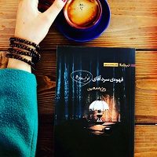

چند روزه دارم به این فکر می کنم که دیگه نویسندگی رو بذارم کنار، شاید تصمیمی احساسی باشه اما وقتی به زندگیم نگاه می کنم، می بینم ساعت های زیادی پشت یه میز نشستم و دارم واسه بیداری آدم ها داستان می نویسم، داستان هایی که خیلی زود فراموش می شن، چون آدم ها داستان زندگی خودشون رو هم فراموش می کنن چه برسه به داستان های تو کتاب ها.

با خودم گفتم دیگه باید به جای پشت میز نشستن و نوشتن، کار دیگه ای انجام بدم و از زندگی کنار دیگران لذت ببرم، مثلا می تونم آکاردئون یاد بگیرم و تو خیابون واسه مردم آهنگ بزنم، یا می تونم صورتم رو آرایش کنم و مثل دلقک های تو سیرک بچه ها رو بخندونم. 

اما شاید بهتر باشه واسه بچه ها داستان بنویسم، داستان های زمان بچگی از یاد کسی نمیره، همه یادشون می مونه داستان عشق دوران بچگی رو، داستان فرار از مدرسه رو، یا داستان هایی که شب ها واسه شون می گفتن تا خوابشون ببره ولی بیدار می موندن.

آدم ها وقتی بزرگ میشن تغییر می کنن، با داستان هایی که واسه بیداری نوشته میشه، می خوابن.

